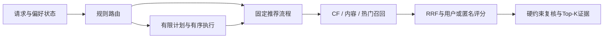

# AgenticRec — Constraint-Aware Interactive Recommendation on InteRecAgent

基于Microsoft InteRecAgent的方法级复现与二次开发。推荐模型、硬约束、反馈状态、有序计划和路由均有工程测试及真实实验；原论文全部条件尚未复现，本项目不是微软官方项目。

## Upstream / My changes / Evidence

| Upstream | My changes | Evidence |
|---|---|---|
| 固定上游的Plan First、ToolBox、CandidateBuffer、Map；memory/reflection/demo已存在 | 隔离legacy/现代环境；U1通过原工具组件接入独立模型 | [走读](docs/source_walkthrough.md)、[逐项差异](docs/UPSTREAM_DIFF.md) |
| 原预制资源与item_seq排序模型 | 自行实现BPR-MF/LightGCN、训练期ID/图/采样、已知用户和匿名种子评分 | [模型结果](../reports/benchmark/t19_live_20261010.json)、[贡献](docs/MY_CONTRIBUTIONS.md) |
| 按工具名转字典的计划、部分排除项降分 | 有序重复步骤、硬过滤、事件化反馈、规则路由、有限重规划 | [回归](tests/regression/test_plan_execution.py)、[约束](tests/unit/test_constraints.py)、[实验](reports/benchmark.md) |



## 真实实验与边界

150条冻结**合成**test episode、三个seed；U1/F/A/O与规定消融共24个run、3,600次episode执行、2,850次正式真实LLM请求。不是3,600个独立样本或线上用户实验。

| 条件 | Strict Success（均值 ± 样本标准差） | 每seed请求数 |
|---|---:|---:|
| U1 upstream_rebuilt | 62.44% ± 1.02% | 190 |
| F fixed_pipeline | 68.67% ± 0.67% | 75 |
| A always_agent | 81.33% ± 0.67% | 190 |
| O ours_router | 81.33% ± 0.67% | 99 |

O相对A请求减少47.89%，本评测的-2个百分点非劣界通过。F有ID类型解析失败，U1有计划契约失败，不能将O/F/U1差距全归因于路由。正式批次实际重规划0次，无法证明其质量收益。无内容消融成功率86%，高于O；三seed LightGCN NDCG@10低于BPR-MF，保留负结果。置信区间、分层与失败见 [T19汇总](../reports/benchmark/t19_live_20261010.md)、[消融](reports/ablations.md)、[失败分析](reports/failure_analysis.md)。

## 离线快速开始

从仓库根目录在PowerShell执行。已验Windows x64 / Python3.11.14 / CPU；其它平台NOT VERIFIED。已有环境不要覆盖。首次取得公开依赖后，演示不需要数据、模型、legacy环境、Key或网络。

```powershell
python reproduction/scripts/bootstrap_uv.py
$env:UV_PYTHON_INSTALL_DIR = "$PWD/reproduction/.runtime/python"
$env:UV_CACHE_DIR = "$PWD/reproduction/.uv-cache"
& reproduction/.runtime/uv.exe python install 3.11.14 --no-bin --no-registry --native-tls
& reproduction/.runtime/uv.exe venv AgenticRec/.venv-dev --python 3.11.14 --offline
& reproduction/.runtime/uv.exe pip install --python AgenticRec/.venv-dev/Scripts/python.exe --native-tls --index-strategy unsafe-best-match --extra-index-url https://download.pytorch.org/whl/cpu -r AgenticRec/requirements.dev.lock.txt
& reproduction/.runtime/uv.exe pip install --python AgenticRec/.venv-dev/Scripts/python.exe --offline --no-build-isolation --no-deps -e AgenticRec
& reproduction/.runtime/uv.exe pip check --python AgenticRec/.venv-dev/Scripts/python.exe
& AgenticRec/.venv-dev/Scripts/python.exe -m agenticrec.cli doctor --offline
& AgenticRec/.venv-dev/Scripts/python.exe -m agenticrec.cli fixture
```

`fixture`用六部自造电影、确定性toy scorer和FakeLLM演示正常推荐、匿名、排除、反馈、无解及A/O路由；不代表训练模型或真实API效果。`doctor`仅查基础环境与配置，不验证GPU或模型质量。CPU索引与PyPI均为官方来源，依赖按lock固定；完整缓存可加`--offline`。

## 真实数据与LLM

[REPRODUCE](docs/REPRODUCE.md)列出实际数据、训练、推荐、完整测试、最小真实调用和报告重建命令。新checkout没有权重，历史seed报告须在全新工作副本先归档保留，完成数据与训练后才可执行：

```powershell
& AgenticRec/.venv-dev/Scripts/python.exe -m agenticrec.cli recommend --request AgenticRec/configs/fixed_request.example.json --model lightgcn --seed 42
```

结构化推荐0LLM；自由文本解析/规划另计请求。发布smoke默认关闭，只在明确授权后执行一次真实规划。Key仅存于被忽略的根目录`.env`。

## 来源、许可与限制

上游 [RecAI/InteRecAgent](https://github.com/microsoft/RecAI/tree/0959ecb05b0794748426e73e6efc1b6b35ec433d/InteRecAgent)，固定commit `0959ecb05b0794748426e73e6efc1b6b35ec433d`；[论文](https://arxiv.org/abs/2308.16505)；保留[MIT代码许可](../LICENSE.txt)。算法引用与原创边界见[贡献清单](docs/MY_CONTRIBUTIONS.md)。

MovieLens使用独立的[GroupLens数据条款](https://files.grouplens.org/datasets/movielens/ml-1m-README.txt)，MIT不适用于数据；本仓库不分发数据、衍生数据、权重、私密trace或Key。T04旧资源ID/许可/canonical论文条件仍BLOCKED；当前质量实验属于规范B路线。其它边界见[已知限制](docs/KNOWN_LIMITATIONS.md)，验收见[STATUS](docs/STATUS.md)、[TASKS](../TASKS.yaml)。
