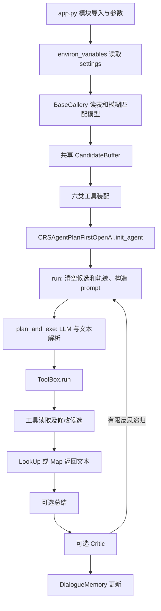

# 固定版本源码走读（T01）

核验日期：2026-10-01。源码：`RecAI/`，commit `0959ecb05b0794748426e73e6efc1b6b35ec433d`。以下行号均相对固定版本 `InteRecAgent/`；文件哈希及 Git blob 见 `reproduction/upstream_lock.json`。

这是源码审计与隔离控制流测试。没有加载真实物品表、相似度或 UniRec checkpoint，没有调用真实 LLM，**A1/A2 NOT VERIFIED；推荐与交互效果 NOT EVALUATED**。

## 装配与一次请求

`app.py` 不是纯 CLI：导入工具（10—22）先于参数解析（128），装配 Gallery（143）、buffer（152）、tools（156—197）、bot（218—234）均在模块级；`init_agent` 在249调用，末尾301启动 Gradio。`--plan_first 1 --langchain 0` 选 OpenAI 直调类（211—216），仍导入 LangChain（Agent文件12，Demo文件6—9）。

## 输入、输出与状态

| 模块 / 符号（起始行） | 输入 | 输出 | 状态与重要语义 |
|---|---|---|---|
| `llm4crs/environ_variables.py`（7—20） | DOMAIN（默认game）、领域 settings | 六个资源/列配置常量 | 路径以模块位置为基准；导入即打开 JSON；没有 settings 会失败 |
| `corups/base.py:BaseGallery.__init__`（39） | 表、列说明、USE_COLS、分类/模糊列 | Gallery / SQL表信息 | `id,title`必需；gte-base 初始化（46、63）；表按title和id建索引（87—89） |
| `BaseGallery._read_file`（227） | csv/tsv/ftr/parquet | pandas DataFrame | CSV设`names=columns`；tsv分隔符仍由调用者传入，默认逗号；无原表不能认定表头和dtype正确 |
| `BaseGallery.__call__`（92） | SQL、可选候选子表、return_id_only | ID列表或查询表 | 使用pandasql；元数据查询与推荐候选筛选分开 |
| `convert_id_2_info`（165）、`convert_title_2_info`（196）、`fuzzy_match`（253） | ID/标题/列名 | 字典或匹配结果 | 原标题与ID转换；重复标题、非连续ID需资源验证 |
| `buffer/base.py:CandidateBuffer`（14） | Gallery、num_limit | 共享可变候选容器 | 初始化/clear是`range(1,len(gallery))`；依赖padding/目录行数约定，不是目录实际ID集合 |
| `init_candidates`（45） | `;;`分隔标题 | 执行文本 | 模糊匹配后覆盖init_memory与memory；逗号分隔的docstring与实际实现不一致 |
| `get/push/update`（74、86、110） | 候选ID | 读取列表/无返回 | push覆盖memory，应用num_limit，并追加plans；并非独立版本存储 |
| `save_similarity/track`（25、32） | 相似度或工具轨迹 | 无返回 | similarity截断；tracker追加；普通push不自动重算或清空similarity |
| `clear/replan`（119、132） | 空/原因 | 无返回/执行文本 | clear恢复初始候选、清计划和similarity，**不清tracker**；clear_tracks单独执行。replan记录failed_plans后将候选设空 |
| `query/query_tool.py:QueryTool.run`（27） | SQL文本 | 元数据JSON文本或错误文本 | 重写字段与LIKE枚举（112），全Gallery查询；长结果随机抽样、截断；仅track，不push候选 |
| `retrieval/sql_tool.py:SQLSearchTool.run`（25） | SQL文本 | 过滤执行日志 | 在当前候选子表查询；候选为空提前停止；超限有ORDER取前N，否则随机抽样；push/track |
| `retrieval/itemcf_tool.py:SimilarItemTool`（15、26） | npy矩阵、标题列表文本 | 相似过滤日志 | np.load允许pickle=false；用种子ID与候选ID直接索引；全库第1列之后算阈值，严格大于阈值；push与save_similarity；没有语义文本向量召回 |
| `ranking/reco_model_tool.py:RecModelTool`（18、50） | UniRec checkpoint；schema/prefer/unwanted JSON | 排序执行日志 | 构造器即加载模型（34），默认CPU；prefer存在强制preference；缺similarity或prefer会回退popularity |
| preference分支（145—180） | 标题转ID形成序列，候选ID | UniRec predict得分与排序ID | `item_seq:[1,L], item_seq_len:[1], item_id:[C]`，没有user_id；sigmoid后mask成1e-15；accuracy topk，diversity multinomial；push |
| `rank_by_pop/rank_by_sim/_rank_by_x`（191、199、208） | 候选、N、分数、masked_items | 排序ID列表 | 热门为log(visited_num+1)；accuracy屏蔽分设-100000后取topk，diversity置零后抽样；不是硬删除 |
| `mapper/map_tool.py:MapTool.run`（30） | 数量字符串 | 标题文本 | 默认5、最大20（app未覆盖）；**取前N，不随机**；无候选返回文本；成功后clear候选，再track |
| `utils/util.py:FuncToolWrapper.run`（76） | 字符串 | 被包函数结果 | 按函数签名是否有参数调用，如候选存储 |
| `agent_plan_first_openai.py:ToolBox`（24、63） | 工具注册表、JSON计划列表、可选profile | `(success, res)` | 非Map工具注册时去掉领域前缀；列表在76/80变字典；同名步骤丢失；工具名用子串匹配（98、128），不是严格白名单 |
| ToolBox后半段（106—152） | 字典计划 | 聚合LookUp/Map文本 | 缺Map时可能自动补`5`；ranking合并历史profile；依字典顺序执行；工具异常即返回；过滤/排序日志不进入res，但在tracker |
| `CRSAgentPlanFirstOpenAI.__init__/init_agent`（246、340） | 工具、Gallery、buffer、engine等 | prompt、DialogueMemory、OpenAICall | demo zero时无selector；init仍需要key；`OPENAI_API_TYPE`；user_profile_update默认-1，故app默认不启UserProfileMemory |
| `run`（417） | `{'input':...}`、可选chat_history/reflection | 回答字符串 | 清失败计数、tracker、buffer；构造表信息、例子、历史；原评测可传chat_history；调用plan_and_exe；成功路径追加human/assistent记忆 |
| `plan_and_exe/_parse_llm_output`（492、523） | prompt和LLM文本 | 回答/计划字符串 | Regex解析Action/Input；找不到Action时Final Answer或原文本被视作完成；Action名解析后没有核验为ToolExecutor；调用ToolBox，成功可总结、失败返回错误 |
| `_summarize_recommendation`（539） | 工具res、tracker、需求、历史 | 第二次LLM回答 | 默认enable_summarize=1，temperature=1；解释不是免费；无显式输出ID核验 |
| `DialogueMemory`（156、201、207、217） | 对话文本 | 历史字符串 | append触发可选shorten；cut直接截断，pure用LLM；属于原版功能 |
| `memory/memory.py:UserProfileMemory`（34、63） | conversation | history/like/unwanted集合 | LLM抽取、最多3次格式解析/修复循环；like/unwanted互相删除再合并；history累计；无字段级provenance；不是训练用户ID |
| `critic/base.py:Critic.__call__`（65） | 需求、回答、历史、工具轨迹 | 是否重做、建议 | LLM调用后Regex解析Yes/No；Agent在449—469递归run；原版已有reflection，不算新增 |
| `demo/base.py:DemoSelector`（31、77） | jsonl示例、请求 | few-shot prompt | fixed取前k，dynamic通过HuggingFaceEmbeddings/Chroma选例；原版已有功能 |
| `utils/open_ai.py:OpenAICall`（33、81） | 提供商、密钥、模型、prompt | 内容字符串 | 新版客户端，外层retry_limits默认5；请求timeout60；客户端未显式max_retries；OAI按包装call记一次而非每尝试；usage默认0，运行兼容性待验 |
| `eval/one_turn_eval.py:RecBotWrapper/one_turn_conversation_eval`（171、214） | context/target | hit和回答列表 | context给bot，target仅由hit_judge比较；agent.clear未在每条样本调用，对话记忆独立性需后续验证 |
| `StaticAgent.run/hit_judge`（191、205） | 元数据/回答、target | 标题文本/布尔hit | 热门是按visited_num加权不放回抽样；RapidFuzz partial_ratio>80，不是ID Hit/NDCG |
| `eval/user_simulator.py:Simulator`（316、351） | history、target、target_info | 模拟用户文本 | 可见隐藏目标，最多5次检测避免直接说出标题；会写共享Conversation。仅prompt限制不等于已证明无泄漏 |
| `conversation_eval`（395） | agent、simulator、Conversation、资源、max_turns | hit/AT及可选OAI、failed_plan | target元数据取自Gallery；recbot读取自己的DialogueMemory，部分其它baseline共享Conversation；用文本hit；旧`openai.error.InvalidRequestError`（450）待兼容验证；不复用为新严格成功指标 |

## 已真实执行的隔离轨迹

命令：`python reproduction/scripts/audit_upstream.py`，日志：`reproduction/logs/g0/audit_v2.*`；完整轨迹：`reproduction/logs/g0/control_flow_trace.json`。

直接从固定源码AST载入原 `CRSAgentPlanFirstOpenAI`、`ToolBox`、`DialogueMemory`、`CandidateBuffer`、`MapTool`，方法体未改，只延迟类型注解。使用原prompt常量与原init_agent，注入自造Gallery、筛选/排序工具和脚本LLM；隔离os对象只含fixture key，不读取真实凭据。

1. 自造目录ID `[0,1,2,3]`，0为fixture padding；原buffer初始化候选`[1,2,3]`。
2. 原run清状态，原prompt构造；脚本LLM返回filter→rank→Map计划。
3. 假filter将`[1,2,3]`变`[1,3]`；假rank变`[3,1]`。这些不是SQL、UniRec或算法验证。
4. **原MapTool**输出`Fixture Comedy C; Fixture Comedy A`，随后原clear恢复候选`[1,2,3]`；tracker保留执行信息。
5. 原总结路径调用第二条脚本LLM回答；原DialogueMemory追加Human/Assistent两条记录。

该轨迹验证了工具装配后实际控制流、候选传递、Map重置与记忆更新。真实API请求为0；没有测token、延迟或推荐质量。reflection、demo、真实SQL、真实模型、真实表头、会话并发仍 **NOT VERIFIED**。

重复LookUp计划另有真实失败证据：`--require-duplicates`退出1，要求first-query和second-query都执行，实际只有second-query。`duplicate_requirement_v2.stderr.log`保留断言与栈；目前**未修复**，T14仍TODO。
